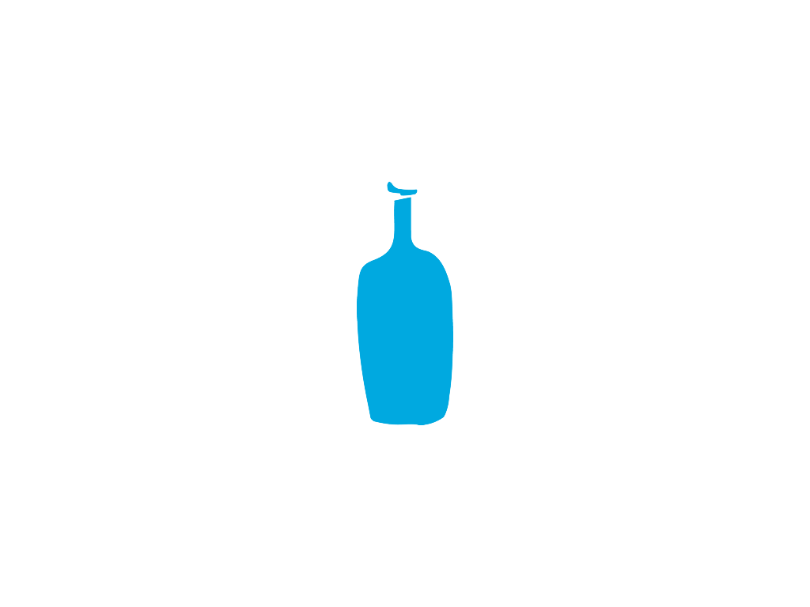

# 목차

- [실행 방법](#실행-방법)
- [프로젝트 소개](#프로젝트-소개)
- [사용된 기술 스택](#사용된-기술-스택)
- [구현한 기능 목록](#구현한-기능-목록)

<br/>

# 실행 방법

```bash
$ git clone https://github.com/suhyeon21/react-homepage.git
```
```bash
$ npm install
```
```bash
$ npm start
```
  
<br/>

# 프로젝트 소개

<div align="center">
			
<br>
<p>
  리액트로 만든 <b> 블루보틀 홈페이지</b> 입니다.
	<br/>
	리액트 공부 후 평소 좋아하던 카페의 홈페이지를 만들어 보았습니다.
  <br/>
  완성 후 redux-toolkit을 공부하여 리팩토링을 진행하였습니다.</p>
</div>

<br/>

# 사용된 기술 스택


<br/>


# 구현한 기능 목록

- CRUD 기능 구현
- Youtube api 사용하여 관련 영상 재생
- kakao map api 사용하여 위치 정보 등록
- flickr api 사용하여 관련 이미지 보여줌
- redux-toolkit을 통한 상태관리

<br/>


